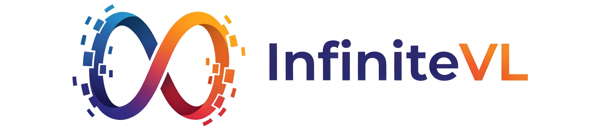
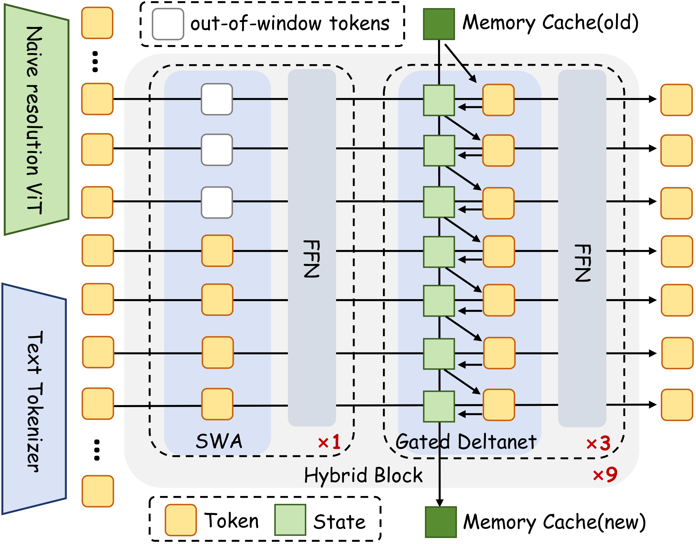
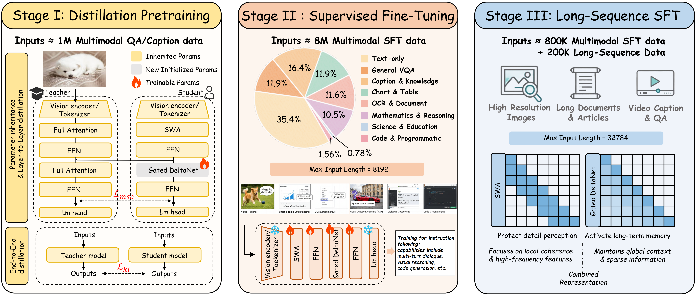
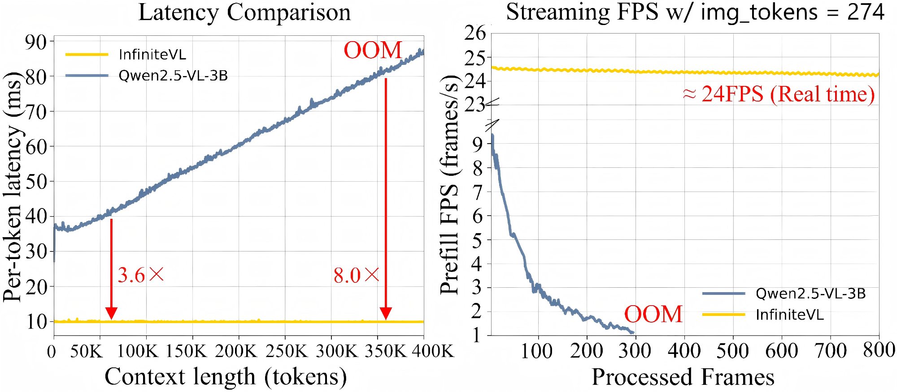
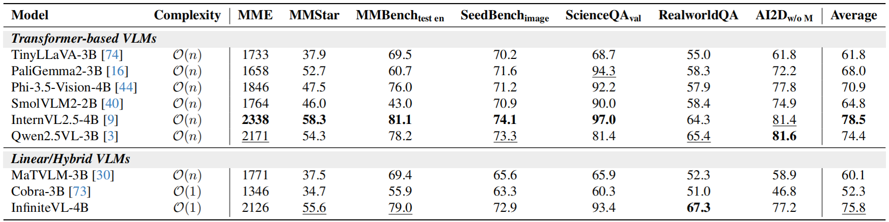
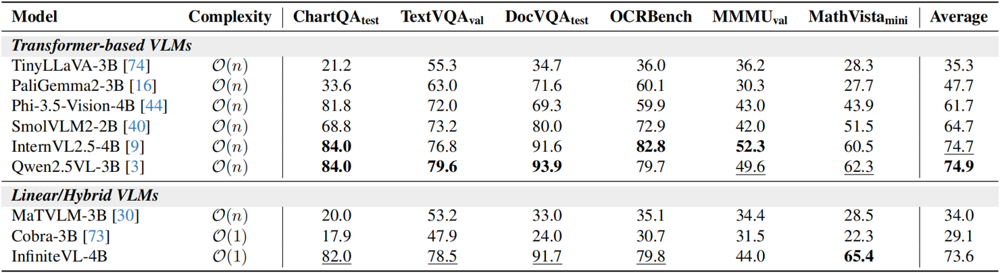
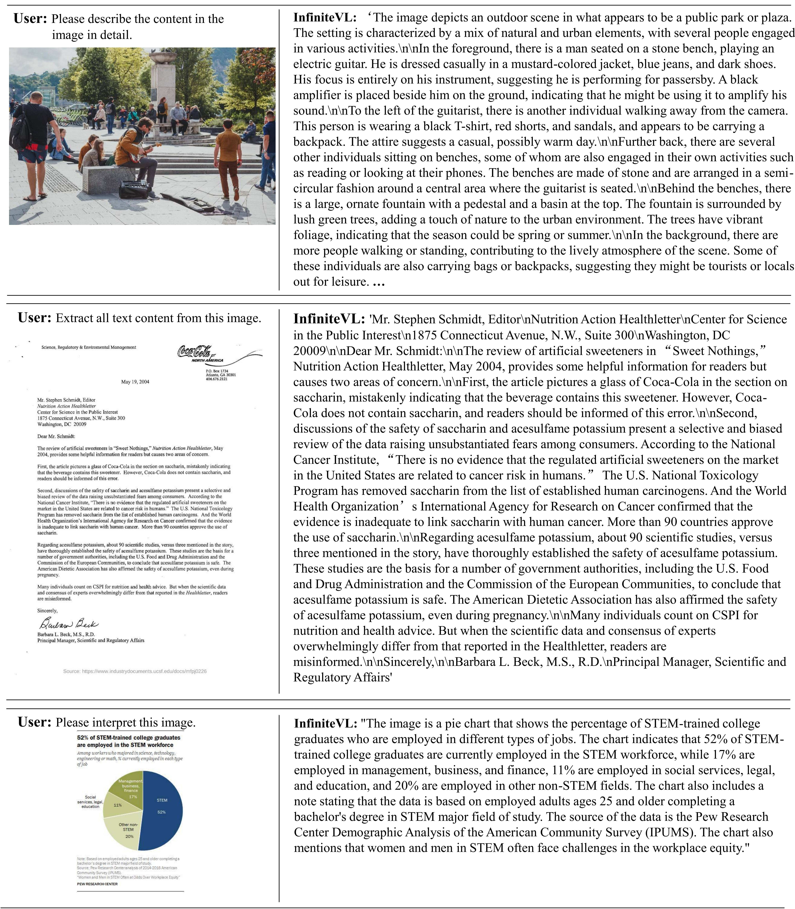
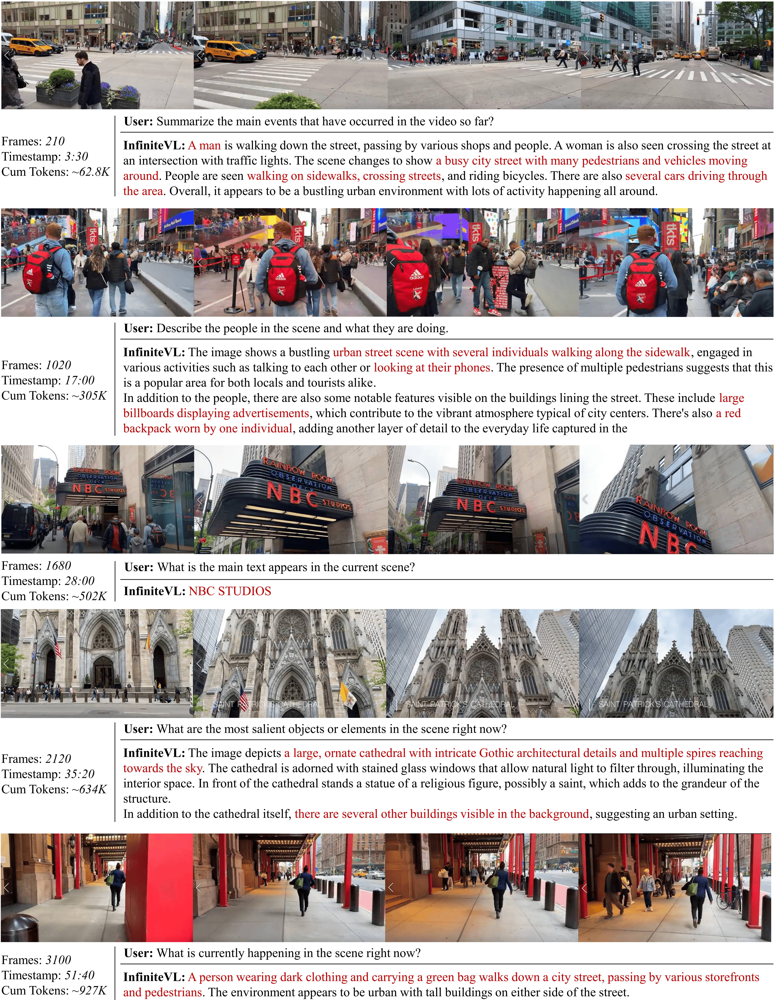
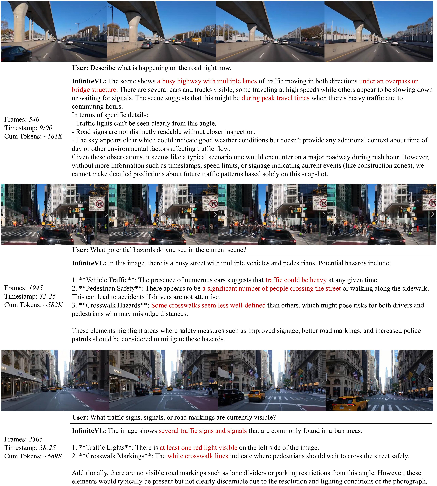

<div align="center">



<hr>

### InfiniteVL: Synergizing Linear and Sparse Attention for Highly-Efficient, Unlimited-Input Vision-Language Models


Hongyuan Tao<sup>1</sup>,
[Bencheng Liao](https://github.com/LegendBC)<sup>1</sup>,
[Shaoyu Chen](https://scholar.google.com/citations?user=PIeNN2gAAAAJ&hl=en&oi=sra)<sup>2</sup>,
Haoran Yin<sup>2</sup>,
[Qian Zhang](https://scholar.google.com/citations?user=pCY-bikAAAAJ&hl=zh-CN)<sup>2</sup>,
[Wenyu Liu](https://scholar.google.com/citations?user=D7jDk7gAAAAJ&hl=en)<sup>1</sup>,
[Xinggang Wang](https://xwcv.github.io)<sup>1,✉️</sup>


<sup>1</sup>Huazhong University of Science and Technology,
<sup>2</sup>Horizon Robotics


(✉️) corresponding author: <a href="mailto:xgwang@hust.edu.cn">xgwang@hust.edu.cn</a>


<br>
<a href="https://arxiv.org/abs/2502.xxxxx"></a>
<a href="https://huggingface.co/hustvl/InfiniteVL/"></a>

</div>

## Introduction

**InfiniteVL** is a novel linear-complexity Vision-Language Model (VLM) architecture designed to overcome the computational bottlenecks of traditional Transformers in processing **unlimited multimodal streams**.


By synergizing **Sliding Window Attention (SWA)** for fine-grained local perception and **Gated DeltaNet** for efficient long-term memory, InfiniteVL achieves a "best of both worlds" balance. It delivers competitive performance on standard benchmarks (comparable to Qwen2.5-VL) while enabling constant-memory inference and high-throughput streaming.

<div align="center">

</div>

### ✨ Key Highlights
*   🚀 **High Efficiency:** Achieves **>3.6×** inference speedup and constant memory footprint compared to FlashAttention-2 accelerated Transformers.
*   ⚡ **Real-Time Streaming:** Sustains a stable **24 FPS** prefill speed on a single **NVIDIA RTX 4090** for continuous video understanding.
*   🧠 **Unlimited Context:** Effectively retains context over extremely long sequences (tested >500K tokens) without OOM errors.
*   🏆 **Strong Performance:** Matches leading Transformer-based VLMs (e.g., Qwen2.5-VL-3B) and significantly outperforms previous linear VLMs (e.g., VL-Mamba, Cobra) on comprehensive aspects.

## News
*   `Dec. 10th, 2025`: We release the **InfiniteVL** model weights and inference code! Please check [Model Zoo](#model-zoo).
*   `Dec. 10th, 2025`: We release our paper on [Arxiv](https://arxiv.org/abs/2512.08829).

## Getting Started

### 🛠️ Environment Setup

We recommend using **Anaconda** or **Miniconda** to manage the environment. The code is tested on **Python 3.11** + **PyTorch 2.6.0** + **CUDA 12.1**.

**1. Clone the repository:**
```bash
git clone https://github.com/hustvl/InfiniteVL.git
cd InfiniteVL
```
**2. Create and activate a virtual environment:**
```bash
conda create -n infinitevl python=3.11 -y
conda activate infinitevl
```
**3. Install Environment:**
```bash
pip install -r requirements.txt
```

## Table of Contents

*   [Introduction](#introduction)
*   [Getting started](#getting-started)
*   [Architecture](#architecture)
*   [Training Strategy](#training-strategy)
*   [Performance & Main Results](#performance)
*   [Model Zoo](#model-zoo) 
*   [Advanced Usage (Streaming)](#advanced-usage-cuda-graph-acceleration)
*   [Qualitative Analysis & Visualization](#qualitative-analysis--visualization)
*   [Citation](#citation)
*   [Acknowledgement](#acknowledgement)

## Architecture

<div align="center">
  <!-- 请确保将论文中的 Figure 2 截图保存为 assets/architecture.png -->
  
</div>
<br>

**InfiniteVL** adopts a hybrid architecture that synergizes the efficiency of linear attention with the precision of window-based attention. The model comprises a **Vision Encoder** (adapted from Qwen2.5-VL), a **Projection MLP**, and a **Decoder-only LLM Backbone**.

### Key Design Highlights

*   **Hybrid Block Design**: The LLM backbone consists of **9 Hybrid Blocks**. Within each block, we strategically interleave:
    *   **1 Sliding Window Attention (SWA) Layer**: Responsible for capturing high-resolution local context and fine-grained visual details.
    *   **3 Gated DeltaNet Layers**: Responsible for modeling long-range global dependencies with linear complexity.

*   **Constant Memory Footprint**: Unlike traditional Transformers where the Key-Value (KV) cache grows linearly with sequence length ($O(N)$), the **Gated DeltaNet** layers compress history into a fixed-size memory state (e.g., $16 \times 128 \times 256$). This enables **constant memory usage** and constant inference latency, even when processing unlimited input streams.

*   **Seamless Integration**: By combining SWA and Gated DeltaNet, InfiniteVL achieves the "best of both worlds":
    *   Local attention ensures high performance on information-intensive tasks (e.g., OCR, Document Understanding).
    *   Linear attention ensures efficiency and stability for long-context scenarios (e.g., Streaming Video Understanding).

## Training Strategy

To achieve strong multimodal performance with minimal training resources, InfiniteVL employs a **three-stage progressive training strategy**. This approach allows our linear-complexity model to inherit the vast knowledge of a Transformer teacher before adapting to long-context scenarios.

<div align="center">
  
</div>

### Stage 1: Distillation Pretraining (Efficient Initialization)
*   **Goal:** Rapidly transfer knowledge from the **Qwen2.5-VL** teacher to the InfiniteVL student.
*   **Method:** We replace the teacher's attention layers with **Gated DeltaNet** while keeping other parameters frozen. We use **Layer-wise MSE Loss** (to align internal states) and **End-to-End KL Divergence** (to align output logits).
*   **Significance:** This bypasses the difficulty of training linear attention from scratch, ensuring a robust initialization.

### Stage 2: Instruction SFT (General Capabilities)
*   **Goal:** Unlock strong instruction-following and reasoning capabilities.
*   **Data:** **~8M** diverse multimodal instruction pairs, covering General VQA, OCR, Mathematics, and Code.
*   **Settings:** Image resolution increased to **1344×1344**; max context length set to 8,192.
*   **Outcome:** Produces the **Stage 2 Model**, which offers the best performance on standard benchmarks.

### Stage 3: Long-Sequence SFT (Context Extension)
*   **Goal:** Activate the architecture's potential for **unlimited-length processing** and streaming.
*   **Data:** A mixture of Stage 2 data (800K) and **~200K long-sequence samples** (e.g., long videos, multi-page documents).
*   **Method:** **LoRA** fine-tuning with context length extended to **32,768**.
*   **Outcome:** Produces the **Stage 3 Model**, enabling length extrapolation and stable streaming inference.


## Performance

### 🚀 Efficiency & Streaming

**InfiniteVL** is engineered for unlimited-input scenarios. Unlike Transformer-based models where cost grows linearly with history, InfiniteVL maintains **constant** computational cost and memory usage.

> **Hardware Setup:** All efficiency results are measured on a single NVIDIA RTX 4090 GPU.

<div align="center">
  <!-- 建议截取论文 Figure 1 (Left) 或 Figure 4 (c/d) -->
  
  <br>
  <em>Figure 1: Comparison of streaming FPS and latency. InfiniteVL sustains real-time performance while Transformer baselines degrade rapidly.</em>
</div>

### 🏆 Multimodal Benchmarks

InfiniteVL achieves state-of-the-art performance among linear-complexity VLMs. Crucially, thanks to our **Hybrid Architecture** and **High-quality training strategies**, it overcomes the traditional weakness of linear models in information-intensive tasks (e.g., OCR, Document Understanding), achieving results comparable to top-tier Transformer VLMs.

<div align="center">
  <!-- 建议截取论文 Figure 1 (Left) 或 Figure 4 (c/d) -->
  
  
  <br>
  <em>Figure 2: Comparison of InfiniteVL with existing VLMs on public multimodal understanding, real-world comprehension, text-rich, reasoning-centric multimodal benchmarks.</em>
</div>
<br>

**Key Takeaways:**
*   **Best-in-Class Linear Model:** Significantly outperforms previous linear VLMs (Cobra, MaTVLM) by large margins (+40-60 points on DocVQA/OCRBench).
*   **Transformer-Level Quality:** Matches the performance of Qwen2.5-VL-3B on complex reasoning and text-rich tasks while being significantly faster in long contexts.


## Model Zoo

We release two versions of InfiniteVL-4B to cater to different application scenarios.

| Model | Stage | Description | Training context Length | Download |
| :--- | :---: | :--- | :---: | :---: |
| **InfiniteVL-4B** | **Stage 2** | **Best Generalist / Base.** The checkpoint directly after Instruction SFT. It delivers the **peak foundational performance** on standard multimodal benchmarks (e.g., OCR, MMMU, MathVista) and preserves the most robust knowledge. | 8K | [🤗 Hugging Face](https://huggingface.co/hustvl/InfiniteVL) |
| **InfiniteVL-4B-LongSFT** | **Stage 3** | **Long-Context Adapted.** Fine-tuned using only a **small amount** of long-sequence multimodal data. It successfully activates length generalization for streaming scenarios, though its full potential on extreme contexts is not yet fully exploited. | 32K | [🤗 Hugging Face](https://huggingface.co/hustvl/InfiniteVL-LongSFT) |


> **💡 Recommendations:**
>
> *   **For Long-Context Inference:** Please use the **Stage 3** model. It enables stable streaming inference and avoids memory explosion.
> *   **For Training / Fine-tuning:** We strongly recommend using the **Stage 2** model as your starting point. Since it maintains the strongest general capabilities and hasn't shifted towards the specific long-context distribution, it serves as the best foundation for adaptation to new tasks or domains.

## 🚀 Advanced Usage: CUDA Graph Acceleration

Unlike Transformer-based VLMs where the KV cache grows dynamically, **InfiniteVL maintains a constant-size memory state**. This unique property allows us to use **CUDA Graphs** to capture the entire computation graph for both streaming prefill and decoding, eliminating kernel launch overheads and maximizing GPU utilization.

This is the key technology behind our **24 FPS** real-time streaming performance.

### ⚡ Accelerated Streaming Inference

Unlike Transformer-based VLMs where the KV cache grows dynamically, **InfiniteVL maintains a constant-size memory state**. This unique property allows us to use **CUDA Graphs** to capture the entire computation graph for streaming prefill, eliminating kernel launch overheads.

We provide a complete script in [`examples/demo_streaming_inference.py`](examples/demo_streaming_inference.py) to demonstrate this capability.

> **🎥 Simulation Note:** This script **simulates a real-time streaming scenario** by reading a local video file frame-by-frame. It treats the video as a continuous data stream, updating the global linear memory state on-the-fly without retraining.
>
> **⚠️ Requirement:** This demo relies on the specialized model implementation (supporting `StaticCachePrealloc` and CUDA Graphs) located in the **[`infinitevl/infinitevl_streaming`](infinitevl/infinitevl_streaming)** directory. Please ensure your environment is set up correctly to import these modules.

#### 1. Run the Simulation Demo
```bash
# Make sure you are in the project root
python examples/demo_streaming_inference.py \
    --model_path /path/to/InfiniteVL-4B \
    --video_path assets/demo.mp4 \
    --fps 30
```

### ⚡ Accelerated Decode

In addition to streaming prefill, InfiniteVL natively supports **CUDA Graph-accelerated decoding**. By capturing the decoding step into a static graph, we can achieve extremely low-latency token generation, further enhancing the responsiveness of real-time interactions.

> 🚧 **Coming Soon:** The code for accelerated decoding is currently being refactored and cleaned up. We are working hard to release it as soon as possible. Please stay tuned!


## Qualitative Analysis & Visualization

We provide visualization cases to demonstrate InfiniteVL's robust performance across diverse scenarios, ranging from information-intensive static tasks to ultra-long streaming video understanding.

### 1. Fundamental Visual-Language Capabilities (OCR & Reasoning)
InfiniteVL effectively overcomes the traditional limitations of linear attention in detailed visual perception. By combining Sliding Window Attention with Gated DeltaNet, it excels at **Dense Text Recognition (OCR), Chart Interpretation, and Complex Scene Description**, delivering performance comparable to full-attention Transformers.

<div align="center">
  <!-- 建议截取论文 Figure 6 -->
  
</div>

### 2. Long-Term Streaming Understanding
The core strength of InfiniteVL lies in its ability to maintain coherent memory over **unlimited input streams**.

The examples below demonstrate a continuous street-view video stream. InfiniteVL maintains a constant memory state and accurately answers questions at various timestamps (e.g., Frame 3100, ~1M tokens processed), recalling specific details like "NBC Studios" text or the color of a pedestrian's bag without forgetting.

<div align="center">
  <!-- 建议截取论文 Figure 7 (或者 Figure 7 和 Figure 8 的拼图) -->
  
  
</div>

## Contact
If you have any questions, please contact Hongyuan Tao via email (hongyuantao@hust.edu.cn).

## Citation

If you find InfiniteVL useful for your research or applications, please consider citing our paper:

```bibtex
@article{tao2025infinitevl,
  title={InfiniteVL: Synergizing Linear and Sparse Attention for Highly-Efficient, Unlimited-Input Vision-Language Models},
  author={Tao, Hongyuan and Liao, Bencheng and Chen, Shaoyu and Yin, Haoran and Zhang, Qian and Liu, Wenyu and Wang, Xinggang},
  journal={arXiv preprint},
  year={2025}
}
```

## Acknowledgement

InfiniteVL is built upon the giants of the open-source community. We would like to express our gratitude to:

*   **[Qwen2.5-VL](https://github.com/QwenLM/Qwen2.5-VL)**: For providing a powerful vision-language codebase and vision encoder.
*   **[Gated DeltaNet](https://github.com/sustcsonglin/flash-linear-attention)**: For the efficient linear attention mechanism and CUDA kernel implementations (FLA).
*   **Open-Source Datasets**: We sincerely thank the creators of the high-quality datasets used in our training, including **FineVision, LLaVA-OneVision, PixMo, The Cauldron, Docmatix, LLaVA-Video**, and others. Their contributions are essential to the development of efficient multimodal models.
