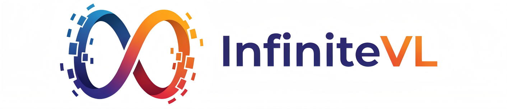
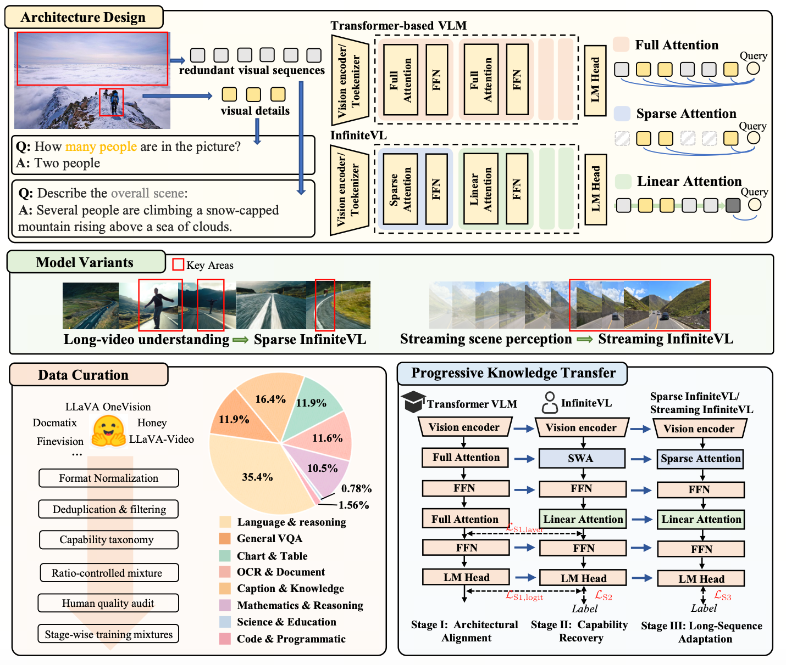
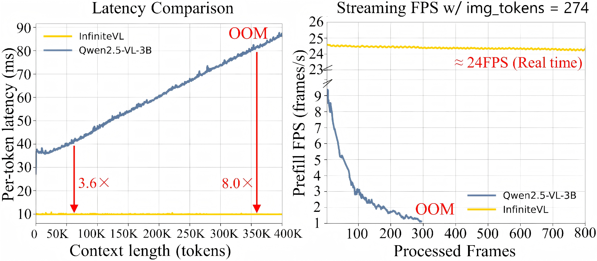
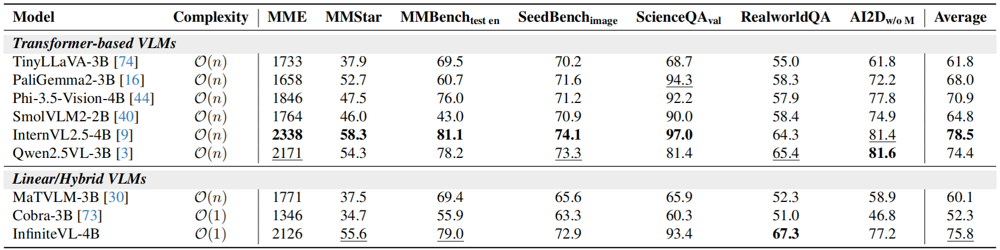
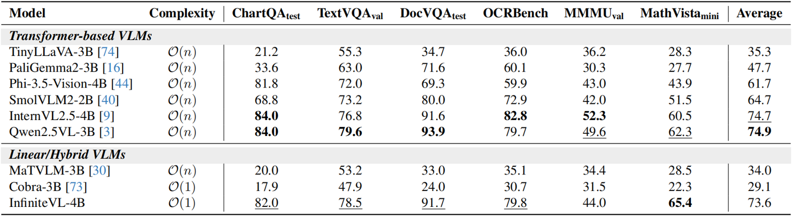
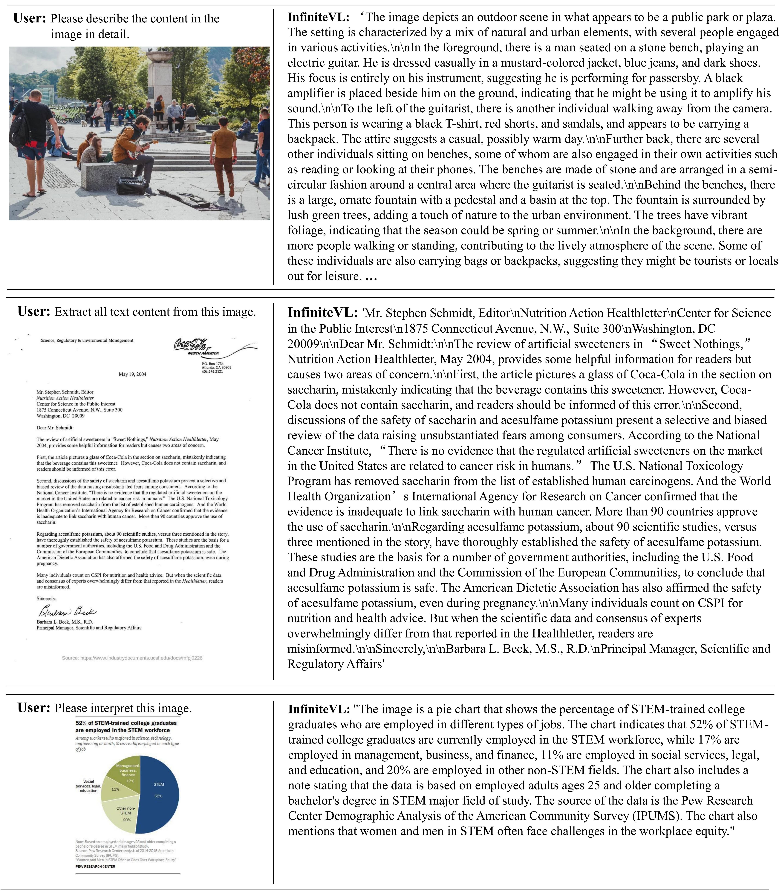
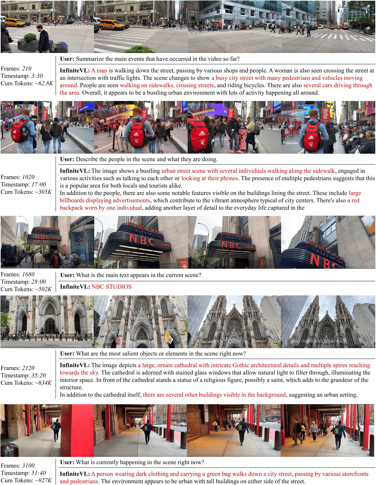
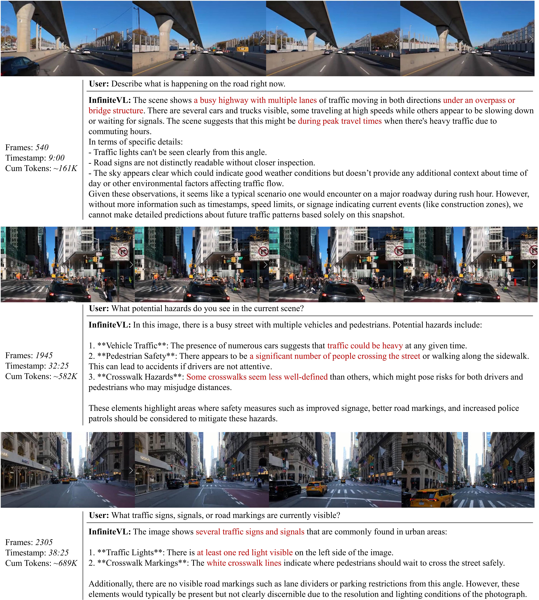

<div align="center">



<h3>
    Neurips 2026
</h3>

<hr>

### InfiniteVL: Synergizing Linear and Sparse Attention for Highly-Efficient, Unlimited-Input Vision-Language Models


[Hongyuan Tao](https://github.com/Hongyuan-Tao)<sup>1</sup>,
[Bencheng Liao](https://github.com/LegendBC)<sup>1</sup>,
[Shaoyu Chen](https://scholar.google.com/citations?user=PIeNN2gAAAAJ&hl=en&oi=sra)<sup>2</sup>,
Haoran Yin<sup>2</sup>,
[Qian Zhang](https://scholar.google.com/citations?user=pCY-bikAAAAJ&hl=zh-CN)<sup>2</sup>,
[Wenyu Liu](https://scholar.google.com/citations?user=D7jDk7gAAAAJ&hl=en)<sup>1</sup>,
[Xinggang Wang](https://xwcv.github.io)<sup>1,✉️</sup>


<sup>1</sup>Huazhong University of Science and Technology,
<sup>2</sup>Horizon Robotics


(✉️) corresponding author: <a href="mailto:xgwang@hust.edu.cn">xgwang@hust.edu.cn</a>


<br>
<a href="https://arxiv.org/abs/2512.08829"></a>
<a href="https://huggingface.co/hustvl/InfiniteVL/"></a>

<br>
<b>🔥 [Aug. 2026] GLM-5.3 & Qwen3.8-next both adopt <u>linear + sparse attention</u> as their core architecture.<br>
InfiniteVL is one of the first fully open-source implementations of this design — with paper, training code, and checkpoints.</b>

</div>

## Introduction

**InfiniteVL** is an efficient Vision-Language Model that combines **linear attention** for compact long-term memory with **sparse attention** for precise visual perception. It achieves Transformer-level multimodal performance while supporting highly efficient long-context processing.

Based on InfiniteVL, we develop two specialized variants:

- **Sparse InfiniteVL** for offline long-video understanding, using dynamic sparse retrieval to preserve fine-grained visual information.
- **Streaming InfiniteVL** for continuous scene perception, enabling real-time streaming with bounded memory usage.

### ✨ Key Highlights

- 🚀 **Efficient Foundation:** InfiniteVL achieves Transformer-level multimodal performance with a **1.7× decoding speedup**.
- 🔎 **Sparse Long-Context Retrieval:** Sparse InfiniteVL achieves a **5× prefill speedup at 256K context**.
- ⚡ **Real-Time Streaming:** Streaming InfiniteVL sustains **25 FPS** with a constant **O(1) memory footprint**.
- 🧠 **Precise and Long-Range:** Sparse attention preserves critical visual details, while linear attention efficiently maintains long-term context.

## News
* `Aug. 28th, 2026`: 🔥 Today's released **GLM-5.3** and **Qwen3.8-next** both adopt **linear + sparse attention** as their core architecture — the design InfiniteVL explored and fully open-sourced (paper + training code + checkpoints) last year. If you want to understand, reproduce, or build on this architecture, this repo is a complete starting point!
* `Feb. 2nd, 2026`: 🚀 We have released the **full training code and scripts**! You can now reproduce our results following the [Training Strategy](#training-strategy).
* `Dec. 10th, 2025`: We release the **InfiniteVL** model weights and inference code! Please check [Model Zoo](#model-zoo).
* `Dec. 10th, 2025`: We release our paper on [Arxiv](https://arxiv.org/abs/2512.08829).

## Getting Started

### 🛠️ Environment Setup

We recommend using **Anaconda** or **Miniconda** to manage the environment. The code is tested on **Python 3.11** + **PyTorch 2.6.0** + **CUDA 12.1**.

**1. Clone the repository:**
```bash
git clone https://github.com/hustvl/InfiniteVL.git
cd InfiniteVL
```
**2. Create and activate a virtual environment:**
```bash
conda create -n infinitevl python=3.11 -y
conda activate infinitevl
```
**3. Install Environment:**
```bash
pip install -r requirements.txt
```

## Table of Contents

*   [Introduction](#introduction)
*   [Getting started](#getting-started)
*   [Architecture & Training](#architecture--training)
*   [Performance & Main Results](#performance)
*   [Model Zoo](#model-zoo) 
*   [Advanced Usage (Streaming)](#advanced-usage-cuda-graph-acceleration)
*   [Qualitative Analysis & Visualization](#qualitative-analysis--visualization)
*   [Citation](#citation)
*   [Acknowledgement](#acknowledgement)

## Architecture & Training

<div align="center">
  
</div>
<br>

InfiniteVL combines **sparse attention** for precise visual perception with **linear attention** for efficient long-term memory. Based on this architecture, we develop two variants for different long-context scenarios:

- **Sparse InfiniteVL** targets offline long-video understanding with dynamic sparse retrieval.
- **Streaming InfiniteVL** targets continuous scene perception with efficient bounded-memory streaming.

Our training follows a three-stage progressive knowledge-transfer pipeline:

1. **Architectural Alignment:** Transfer knowledge from a Transformer VLM to InfiniteVL through layer-wise and logit distillation.
2. **Capability Recovery:** Restore strong general multimodal capabilities with continuous supervised fine-tuning.
3. **Long-Sequence Adaptation:** Specialize InfiniteVL into Sparse InfiniteVL and Streaming InfiniteVL for offline and online long-context understanding.


### ⚙️ Reproduction Steps

Our training codebase is built upon **[LLaMA-Factory](https://github.com/hiyouga/LLaMA-Factory)**. Please refer to their repository for detailed documentation and framework usage.

We provide standard scripts to reproduce our three-stage training pipeline. The training is launched via `train.sh`.

> **Note:** Before running, please modify the `model_name_or_path`, `dataset` and `checkpoint_path` inside the `.yaml` files to point to your local directories.

**1. Distillation Pretraining (layer to layer)**
```bash
bash train.sh examples/train_linear/train_config_distill_stage1.yaml
```

**2. Distillation Pretraining (End to End)**
```bash
bash train.sh examples/train_linear/train_config_distill_stage2.yaml
```

**3. Instruction SFT**
```bash
bash train.sh examples/train_linear/train_config_distill_sft.yaml
```

## Performance

### 🚀 Efficiency & Streaming

**InfiniteVL** is engineered for unlimited-input scenarios. Unlike Transformer-based models where cost grows linearly with history, InfiniteVL maintains **constant** computational cost and memory usage.

> **Hardware Setup:** All efficiency results are measured on a single NVIDIA RTX 4090 GPU.

<div align="center">
  <!-- 建议截取论文 Figure 1 (Left) 或 Figure 4 (c/d) -->
  
  <br>
  <em>Figure 1: Comparison of streaming FPS and latency. InfiniteVL sustains real-time performance while Transformer baselines degrade rapidly.</em>
</div>

### 🏆 Multimodal Benchmarks

InfiniteVL achieves state-of-the-art performance among linear-complexity VLMs. Crucially, thanks to our **Hybrid Architecture** and **High-quality training strategies**, it overcomes the traditional weakness of linear models in information-intensive tasks (e.g., OCR, Document Understanding), achieving results comparable to top-tier Transformer VLMs.

<div align="center">
  <!-- 建议截取论文 Figure 1 (Left) 或 Figure 4 (c/d) -->
  
  
  <br>
  <em>Figure 2: Comparison of InfiniteVL with existing VLMs on public multimodal understanding, real-world comprehension, text-rich, reasoning-centric multimodal benchmarks.</em>
</div>
<br>

**Key Takeaways:**
*   **Best-in-Class Linear Model:** Significantly outperforms previous linear VLMs (Cobra, MaTVLM) by large margins (+40-60 points on DocVQA/OCRBench).
*   **Transformer-Level Quality:** Matches the performance of Qwen2.5-VL-3B on complex reasoning and text-rich tasks while being significantly faster in long contexts.


## Model Zoo

We release two versions of InfiniteVL-4B to cater to different application scenarios.

| Model | Stage | Description | Training context Length | Download |
| :--- | :---: | :--- | :---: | :---: |
| **InfiniteVL-4B** | **Stage 2** | **Best Generalist / Base.** The checkpoint directly after Instruction SFT. It delivers the **peak foundational performance** on standard multimodal benchmarks (e.g., OCR, MMMU, MathVista) and preserves the most robust knowledge. | 8K | [🤗 Hugging Face](https://huggingface.co/hustvl/InfiniteVL) |
| **InfiniteVL-4B-LongSFT** | **Stage 3** | **Long-Context Adapted.** Fine-tuned using only a **small amount** of long-sequence multimodal data. It successfully activates length generalization for streaming scenarios, though its full potential on extreme contexts is not yet fully exploited. | 32K | [🤗 Hugging Face](https://huggingface.co/hustvl/InfiniteVL-LongSFT) |


> **💡 Recommendations:**
>
> *   **For Long-Context Inference:** Please use the **Stage 3** model. It enables stable streaming inference and avoids memory explosion.
> *   **For Training / Fine-tuning:** We strongly recommend using the **Stage 2** model as your starting point. Since it maintains the strongest general capabilities and hasn't shifted towards the specific long-context distribution, it serves as the best foundation for adaptation to new tasks or domains.

## 🚀 Advanced Usage: CUDA Graph Acceleration

Unlike Transformer-based VLMs where the KV cache grows dynamically, **InfiniteVL maintains a constant-size memory state**. This unique property allows us to use **CUDA Graphs** to capture the entire computation graph for both streaming prefill and decoding, eliminating kernel launch overheads and maximizing GPU utilization.

This is the key technology behind our **24 FPS** real-time streaming performance.

### ⚡ Accelerated Streaming Inference

Unlike Transformer-based VLMs where the KV cache grows dynamically, **InfiniteVL maintains a constant-size memory state**. This unique property allows us to use **CUDA Graphs** to capture the entire computation graph for streaming prefill, eliminating kernel launch overheads.

We provide a complete script in [`examples/demo_streaming_inference.py`](examples/demo_streaming_inference.py) to demonstrate this capability.

> **🎥 Simulation Note:** This script **simulates a real-time streaming scenario** by reading a local video file frame-by-frame. It treats the video as a continuous data stream, updating the global linear memory state on-the-fly without retraining.
>
> **⚠️ Requirement:** This demo relies on the specialized model implementation (supporting `StaticCachePrealloc` and CUDA Graphs) located in the **[`infinitevl/infinitevl_streaming`](infinitevl/infinitevl_streaming)** directory. Please ensure your environment is set up correctly to import these modules.

#### 1. Run the Simulation Demo
```bash
# Make sure you are in the project root
python examples/demo_streaming_inference.py \
    --model_path /path/to/InfiniteVL-4B \
    --video_path assets/demo.mp4 \
    --fps 30
```

### ⚡ Accelerated Decode

In addition to streaming prefill, InfiniteVL natively supports **CUDA Graph-accelerated decoding**. By capturing the decoding step into a static graph, we can achieve extremely low-latency token generation, further enhancing the responsiveness of real-time interactions.

> 🚧 **Coming Soon:** The code for accelerated decoding is currently being refactored and cleaned up. We are working hard to release it as soon as possible. Please stay tuned!


## Qualitative Analysis & Visualization

We provide visualization cases to demonstrate InfiniteVL's robust performance across diverse scenarios, ranging from information-intensive static tasks to ultra-long streaming video understanding.

### 1. Fundamental Visual-Language Capabilities (OCR & Reasoning)
InfiniteVL effectively overcomes the traditional limitations of linear attention in detailed visual perception. By combining Sliding Window Attention with Gated DeltaNet, it excels at **Dense Text Recognition (OCR), Chart Interpretation, and Complex Scene Description**, delivering performance comparable to full-attention Transformers.

<div align="center">
  <!-- 建议截取论文 Figure 6 -->
  
</div>

### 2. Long-Term Streaming Understanding
The core strength of InfiniteVL lies in its ability to maintain coherent memory over **unlimited input streams**.

The examples below demonstrate a continuous street-view video stream. InfiniteVL maintains a constant memory state and accurately answers questions at various timestamps (e.g., Frame 3100, ~1M tokens processed), recalling specific details like "NBC Studios" text or the color of a pedestrian's bag without forgetting.

<div align="center">
  <!-- 建议截取论文 Figure 7 (或者 Figure 7 和 Figure 8 的拼图) -->
  
  
</div>

## Contact
If you have any questions, please contact Hongyuan Tao via email (hongyuantao@hust.edu.cn).

## Citation

If you find InfiniteVL useful for your research or applications, please consider citing our paper:

```bibtex
@article{tao2025infinitevl,
  title={InfiniteVL: Synergizing Linear and Sparse Attention for Highly-Efficient, Unlimited-Input Vision-Language Models},
  author={Tao, Hongyuan and Liao, Bencheng and Chen, Shaoyu and Yin, Haoran and Zhang, Qian and Liu, Wenyu and Wang, Xinggang},
  journal={arXiv preprint},
  year={2025}
}
```

## Acknowledgement

InfiniteVL is built upon the giants of the open-source community. We would like to express our gratitude to:

*   **[Qwen2.5-VL](https://github.com/QwenLM/Qwen2.5-VL)**: For providing a powerful vision-language codebase and vision encoder.
*   **[Gated DeltaNet](https://github.com/sustcsonglin/flash-linear-attention)**: For the efficient linear attention mechanism and CUDA kernel implementations (FLA).
*   **Open-Source Datasets**: We sincerely thank the creators of the high-quality datasets used in our training, including **FineVision, LLaVA-OneVision, PixMo, The Cauldron, Docmatix, LLaVA-Video**, and others. Their contributions are essential to the development of efficient multimodal models.
